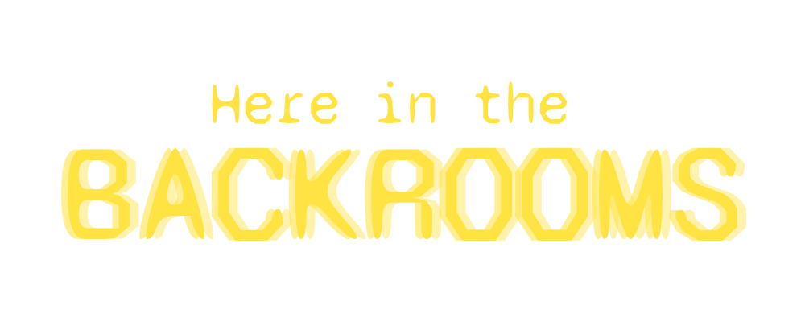

# 🔦 The Backrooms: Graphical Adventure

<div align="center">
  
  <br>
  <em>"Si vous ne faites pas attention et que vous noclip au mauvais endroit..."</em>
  <br><br>

  
  
  
  
</div>

---

## 🚧 Projet en cours de développement

Ce dépôt contient la **version graphique** du jeu d'exploration *The Backrooms*.
Il est réalisé dans le cadre de l'UE **POO-IHM 2 (2026)** de la Licence 3 Informatique à l'Université de Poitiers.

L'objectif est de produire deux applications interconnectées respectant le modèle **MVC** :
1.  🎮 **Le Jeu :** Une aventure graphique en 2D (vue de dessus).
2.  🗺️ **L'Éditeur de Niveaux :** Un outil pour concevoir les maps (placement des murs, entités, items).

---

## 🏗️ Architecture Technique

Le projet applique strictement le patron de conception **Modèle-Vue-Contrôleur (MVC)** pour séparer la logique métier de l'interface graphique Swing.

### 📂 Structure du code
* **`model`** : Contient toute la logique du jeu (indépendante de l'affichage).
    * `entity` : Gestion du *Hero*, des *Monstres* et des *NPC* (ex: Stéphane !).
    * `world` : Génération procédurale ou chargement des niveaux (`WorldBuilder`, `Locations`).
    * `item` : Système d'inventaire (`Backpack`, `Weapon`, `Food`).
* **`view`** : L'interface graphique utilisateur (GUI).
    * `GameWindow` : La fenêtre principale de jeu.
    * `WorldWindow` : La vue de la carte / éditeur.
    * `MenuWindow` : Les menus de configuration et de pause.
* **`controller`** : Fait le lien entre les entrées utilisateur (clavier/souris) et le modèle.
    * `GameController` : Orchestre la boucle de jeu.

### 🎨 Assets & Graphismes
Le jeu utilise des sprites 2D personnalisés pour une ambiance rétro/pixel-art :
* Environnement : `Wall_2.png`, `Ground.png`, `Void.png`.
* Entités : `Stéphane_Pixel.png` (Guest star ?), `Entity.png`.

---

## 🚀 Fonctionnalités (Roadmap)

- [x] **Moteur de Jeu de base :** Boucle de jeu et initialisation de la fenêtre.
- [x] **Architecture MVC :** Séparation claire des packages.
- [x] **Modèle de données :** Gestion du héros, de l'inventaire et des stats.
- [ ] **Déplacement :** Navigation fluide du personnage sur la grille.
- [ ] **Éditeur de Niveaux :** Interface pour placer les murs et créer des maps personnalisées.
- [ ] **Configuration :** Menu pour choisir la résolution et les touches.
- [ ] **Système de Combat :** Interaction avec les entités hostiles.

---

## 🛠️ Installation et Lancement

### Prérequis
* Java JDK 17 ou supérieur.
* Maven.

### Commandes
```bash
# Cloner le projet
git clone [https://github.com/ton-pseudo/backrooms-graphical-adventure.git](https://github.com/ton-pseudo/backrooms-graphical-adventure.git)

# Aller dans le dossier du module
cd backrooms

# Compiler le projet
./mvnw clean install

# Lancer le jeu
# (Assurez-vous que la classe principale est bien configurée dans le pom.xml ou lancez via l'IDE)
java -jar target/backrooms-1.0-SNAPSHOT.jar
